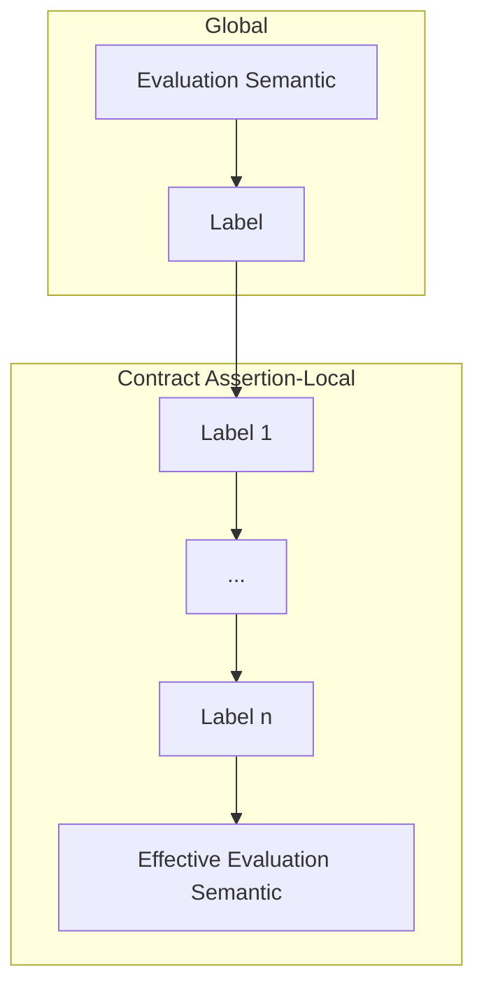

# Evaluation Semantics

PyPactum allows runtime-evaluation of contract assertions, and indeed, by default, they are. However,
there is a range of knows to change that behavior.

## Global Evaluation Semantic

At the outermost level, Pactum offers a global switch:

```python
# Turn off all (?) runtime checking
set_contract_evaluation_semantic(EvaluationSemantic.ignore)
```

## Labels

Contract assertions can have labels which can affect the effective evaluation semantic for that
assertion. Labels are functions that take an evaluation semantic and some information about the
concrete contract assertion, and return a new evaluation semantic.

### Local Labels

Currently, the library comes with three labels that can be used with the `labels` parameter
of contract assertions:

1. **expensive**  
   This label is supposed to mark very expensive contract checks, and allows turning those off
   separately.
2. **ignore**  
   This label unconditionally turns this contract assertion off. This might be useful during
   development to temporarily silence flaky assertions.
3. **check**  
   This label unconditionally turns this contract assertion on. This is useful if violating the
   condition has severe consequences, e.g. in security or safety contexts.

Labels are applied in order, i.e. the last label has the final say over what the effective evaluation
semantic is.

### The Global Label

Additionally, there is a configurable global label, which affects all contract assertions. The
library currently ships two labels meant for use as global label:

1. **ignore_postconditions**  
   This label turns off all postconditions.
2. **filter_by_module**  
   Technically a label factory, this allows to only turn on assertions in specific modules.

For example:

```python
set_global_contract_assertion_label(labels.filter_by_module("mymodule.*"))
```

This graph shows the steps taken to determine the effective semantic of a contract assertion:

